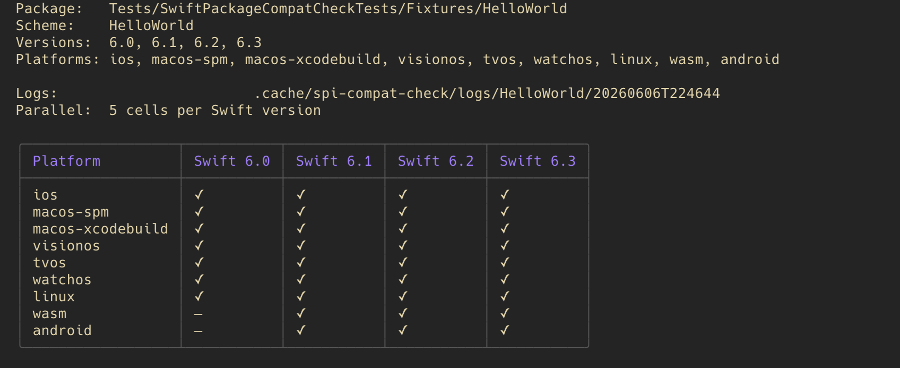

# swift-package-compat-check (`spcc`)

[](https://swiftpackageindex.com/Kingpin-Apps/swift-package-compat-check)
[](https://swiftpackageindex.com/Kingpin-Apps/swift-package-compat-check)

Run the [Swift Package Index](https://swiftpackageindex.com) build matrix against your Swift package locally, so you don't have to push a tag and wait for SPI's CI queue to find out a platform broke.

`spcc` reproduces the same `(platform × Swift version)` recipe SPI runs on its own builders — same Docker images, same `xcodebuild` destinations, same `swift build --swift-sdk` invocations — and prints a `✓`/`✗` matrix you can diff against the SPI badge.



---

## Requirements

| Requirement | Version | Why |
|-------------|---------|-----|
| macOS       | 15+     | `spcc` is a macOS-only tool. |
| Xcode       | 26.4+   | For the Apple-platform cells (`macos-spm`, `macos-xcodebuild`, `ios`, `tvos`, `watchos`, `visionos`). Multiple Xcodes can be selected per Swift version via `--xcode-6.X`. |
| Container runtime | Docker (any modern release) or [apple/container](https://github.com/apple/container) 0.12+ | For `linux`, `android`, `wasm` cells. Apple cells don't need either. Default is `docker`; pass `--container-runtime container` to opt into apple/container (experimental — see [Container runtime](#container-runtime) below). |
| Swift       | 6.2+    | Only needed to build `spcc` from source. |

---

## Installation

```bash
brew install kingpin-apps/tap/spcc
```

Or build from source with Swift Package Manager:

```bash
git clone https://github.com/Kingpin-Apps/swift-package-compat-check.git
cd swift-package-compat-check
swift build -c release
cp .build/release/spcc ~/.local/bin/spcc
```

Make sure `~/.local/bin` is on your `$PATH` (or copy somewhere else that is).

---

## Quick start

```bash
# Show the matrix that would run without actually building anything
spcc run --dry-run

# Run the full matrix against the package in the current directory
spcc run

# Run a subset for fast iteration
spcc run -p macos-spm,linux -s 6.3

# Run against a package elsewhere
spcc run --path ~/Projects/swift-nacl

# Run `swift test` per cell instead of `swift build`
spcc run --test -p macos-spm,linux -s 6.3

# Install extra system packages the tests need (only applied with --test).
# Host packages go on the Mac via brew (Apple cells); container packages go
# inside each Linux/Android/Wasm container via apt.
spcc run --test --install-host gnupg --install-container "gnupg,libgcrypt20-dev" \
  -p macos-spm,linux -s 6.3

# Run each cell's tests serially for suites that share global state (keyrings,
# ports, temp files). Distinct from --max-parallel, which bounds cell concurrency.
spcc run --test --test-no-parallel -p macos-spm,linux -s 6.3

# Load default flags from a config file (--config wins over $SPCC_CONFIG)
spcc run --config ./.spi-compat.toml
SPCC_CONFIG=~/.config/spcc.toml spcc run
```

When a cell fails, its log path is printed below the matrix so you can drill in:

```
Failed cells (1):
  ✗ wasm × Swift 6.3   /Users/me/.cache/spi-compat-check/logs/swift-nacl/.../wasm-6.3.log
```

---

## Subcommands

| Subcommand | Purpose |
|------------|---------|
| `spcc run [path]` | Run the matrix (default subcommand — bare `spcc` is equivalent). |
| `spcc clean [path]` | Remove the package's caches (Docker volumes + log/derived-data/cloned-packages dirs). |
| `spcc clean-all [--remove-images]` | Wipe every spi-compat cache globally. `--remove-images` also drops cached SPI builder images (typically 50+ GB). |
| `spcc list-caches` | `du`-style report of all caches + Docker volumes + builder images. |
| `spcc images [--remove]` | List or remove cached SPI builder images. |

Run `spcc <subcommand> --help` for the full flag list.

---

## What it actually runs

Each cell of the matrix reproduces SPI's own Build Command panel verbatim:

| Platform | Command |
|----------|---------|
| `linux` | `docker run … spi-images:basic-X.Y-latest swift build --triple x86_64-unknown-linux-gnu` |
| `macos-spm` | `xcrun swift build --arch arm64` |
| `macos-xcodebuild` | `xcrun xcodebuild build -scheme <s> -destination platform=macOS,arch=arm64` |
| `ios` / `tvos` / `watchos` / `visionos` | `xcrun xcodebuild build -scheme <s> -destination generic/platform=<SDK>` |
| `android` | `docker run … spi-images:android-X.Y-latest swift build --swift-sdk aarch64-unknown-linux-android28` |
| `wasm` | `docker run … spi-images:wasm-X.Y-latest swift build --swift-sdk swift-X.Y-RELEASE_wasm` |

Apple cells use whichever Xcode `xcode-select` points at by default. Linux / Android / Wasm cells use SPI's own publicly-hosted builder images at `registry.gitlab.com/swiftpackageindex/spi-images:<platform>-X.Y-latest`, so the SDKs and apt packages match SPI exactly.

For full documentation including all flags, caching behaviour, and troubleshooting, see the **[`SwiftPackageCompatCheck` DocC catalog](Sources/SwiftPackageCompatCheck/SwiftPackageCompatCheck.docc/Documentation.md)**.

---

## Container runtime

Linux / Android / Wasm cells dispatch through a host-side container runtime. The default is `docker`. You can opt into [apple/container](https://github.com/apple/container) (Apple Silicon, `Virtualization.framework`) via:

```bash
# CLI flag
spcc run --container-runtime container

# Or persist in .spi-compat.toml
container_runtime = "container"
```

apple/container support is **experimental**. It reuses the same SPI builder images and produces identical pass/fail results in `spcc`'s smoke tests, but it hasn't yet been validated against as wide a range of real-world packages as Docker — which is why Docker stays the default.

Things to know when using apple/container:

- Image pulls happen as an explicit pre-step (apple/container has no `--pull` on `run`); concurrent cells share a single pull.
- apple/container caps per-container memory at **1 GB by default**, which OOM-kills any non-toy Swift build. `spcc` raises this to 8 GB per cell so builds get a comparable allotment to Docker Desktop's VM.
- Pair `--container-runtime container` with `--timeout` (e.g. `--timeout 1800`) when running long matrices unattended. Without a timeout, a stuck cell sits indefinitely rather than failing fast.

## Caches

`spcc` keeps a stable per-package cache so repeat runs are fast:

```
~/.cache/spi-compat-check/
├── derived-data/<pkg>/<platform>-<sv>/    ← xcodebuild incremental state
├── cloned-packages/<pkg>/                 ← SourcePackages cache shared across xcodebuild cells
└── logs/<pkg>/<RUN_TS>/<platform>-<sv>.log
```

Plus Docker volumes named `spi-compat-build-<pkg>-<sv>` (Linux) and `spi-compat-build-<pkg>-<platform>-<sv>` (Android/Wasm) holding the cross-SDK scratch path.

Logs auto-trim to the latest 5 runs per package. Use `spcc list-caches` to see total disk usage, `spcc clean <pkg>` to drop one package's caches, `spcc clean-all` to nuke everything.

Override the cache root with `SPI_COMPAT_CACHE=/custom/path spcc run`.

---

## Features

- **Live updating matrix** under a TTY — cells transition `?` → `⠋⠙⠹⠸⠼⠴⠦⠧⠇⠏` (braille spinner) → `✓`/`✗` in place, no scrollback.
- **Scheme auto-detection** via `swift package dump-package` — skips system C targets like `Clibsodium` that alphabetically win against the real Swift library product.
- **Per-Swift-version overrides** — `--xcode-6.X`, `--toolchain-6.X`, `--linux-image-6.X`, `--android-image-6.X`, `--wasm-image-6.X`, `--wasm-sdk-url-6.X`.
- **Bounded concurrent fan-out** — `--max-parallel N` runs cells in parallel within each Swift version. Defaults to `activeProcessorCount / 2`.
- **Test-dependency installs** — `--install-host` (brew, on the Mac for Apple cells) and `--install-container` (apt, inside each Linux/Android/Wasm container) pull in system packages a package's tests need — e.g. `gpg` for swift-gnupg. Applied only with `--test`. Host installs run once and **persist** on your machine; container installs are ephemeral. Both accept a comma-separated list and are validated against shell injection.
- **Serial test execution** — `--test-no-parallel` runs each cell's tests serially (`swift test --no-parallel` / `xcodebuild test -parallel-testing-enabled NO`) for suites that share global state. Orthogonal to `--max-parallel`, which bounds how many cells run at once.
- **Timeout safety net** — `--timeout SECONDS` kills hung containers so a stuck cell fails fast instead of blocking the run.
- **Qemu IPC retry** — the cross-SDK resolver detects transient "failed parsing the Swift compiler output" errors under qemu emulation and retries the build before falling back. Critical for Android/Wasm cells against large packages on Apple Silicon.
- **Multi-arch bundle extraction** — when an Android SDK bundle ships multiple triples (the finagolfin/swift-android-sdk case), `spcc` extracts the specific triple matching SPI's intent rather than building for every architecture in the bundle.

---

## Development

```bash
just test           # Unit tests
just hello          # Smoke-test spcc against the bundled HelloWorld fixture
just hello-full     # Full 34-cell matrix against HelloWorld (slow on first run)
just build          # Debug build
just release        # Release build for current host arch
just bump           # Cut a release: `cz bump` then push --follow-tags
```

The [DocC catalog](Sources/SwiftPackageCompatCheck/SwiftPackageCompatCheck.docc/Documentation.md) doubles as the full user guide and the API documentation for the `SwiftPackageCompatCheck` library target.

---

## License

MIT. See [LICENSE](LICENSE).
